## Overview

The Admin & Finance Menu provides financial approval processes and reporting functionality. It's located in the Admin & Finance Menu section of the sidebar navigation.

To access the finance features, scroll down in the left sidebar until you see the "ADMIN & FINANCE MENU" section:

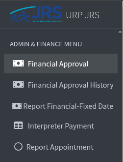

The Admin & Finance Menu contains the following options:

- **Financial Approval** - View and manage client financial approvals
- **Financial Approval History** - Access historical financial approval data
- **Report Financial-Fixed Date** - Generate financial reports for specific date ranges
- **Interpreter Payment** - Manage interpreter payment processing
- **Report Appointment** - Generate appointment-related reports

### Financial Approval

The Financial Approval feature allows you to view and manage client financial approvals.

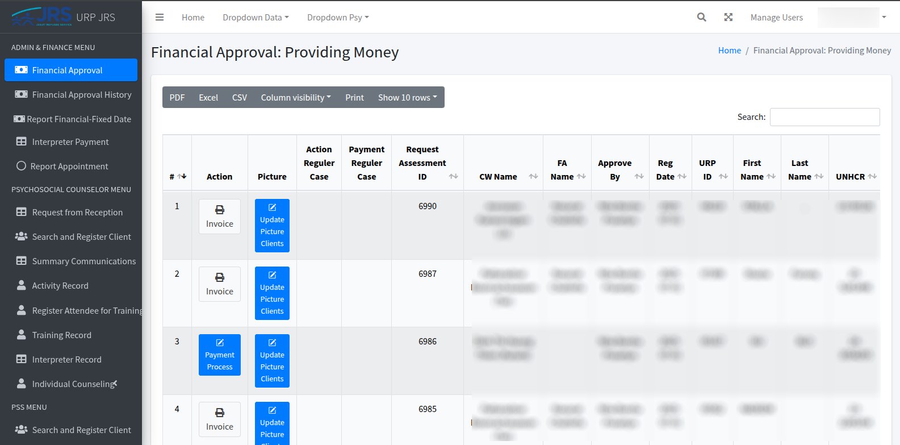

**Export and Control Options -**
- **PDF** - Export data to PDF format
- **Excel** - Export data to Excel spreadsheet
- **CSV** - Export data to CSV file
- **Column visibility** - Toggle which columns to display
- **Print** - Print the current data view
- **Show 10 rows** - Control number of rows displayed per page

**Search Functionality -**
- **Search box** in the top right for filtering records across all data fields

**Available Actions -**

- **Payment Process** - Process payments for approved financial assistance
- **Invoice** - Generate invoices for approved cases
- **Update Picture Clients** - Update client photos/documentation

#### Payment Process Workflow

Before accessing the Financial Approval page, the following workflow occurs -

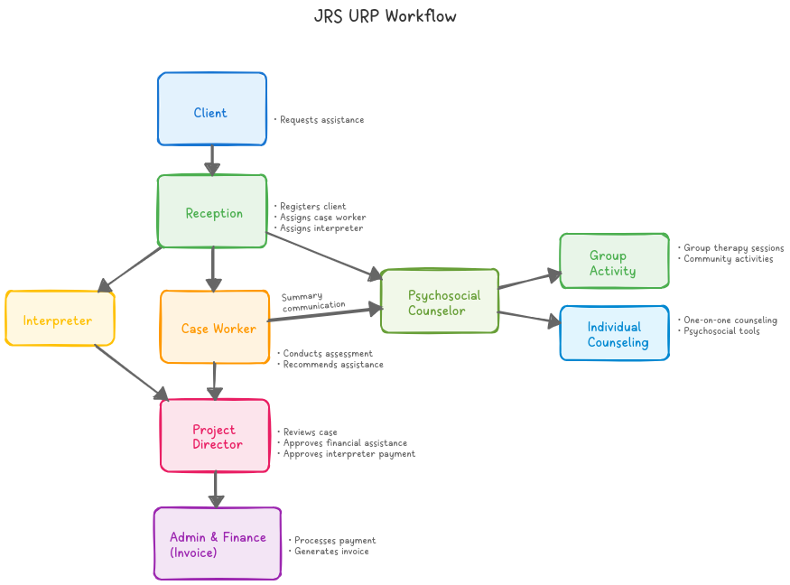

1. A **Client** makes contact to the _Reception_, via phone call, walk-in or LINE app
2. The **Reception** searches the client's information in the URP system. If there's not, the client is going to be registered as new, regardless of whether they meet the criteria
3. A **Case Worker** is assigned to the client by the _Reception_. An **Interpreter** is also assigned by the _Reception_ if necessary
4. The _Case Worker_ makes assessements to the _Client_ and submit assistance recommendation to **Project Director**
5. If the _Client_ is in need of psychosocial support, the _Case Worker_ also makes requests to a **Psychosocial Counselor** with a summary of communication with the client.
6. The **Project Director** reviews records submitted by the _Case Worker_ and makes approval for the Finance Assistance and the amount of funds for each of Housing, Food, Medical and Transportation.
7. The **Project Director** also reviews Interpreter activity and makes approval to settle interpreter payments. 
8. Afer the **Project Director**'s approval, the finanical assistance record will show up in the "Financial Approval" page.

##### Payment Processing

When you click the **Payment Process** button for a client, you will reach the payment processing page.

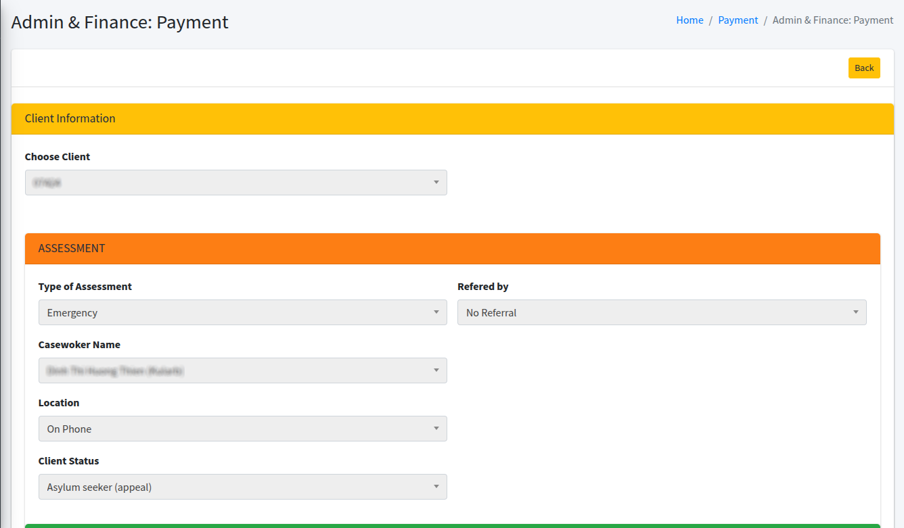

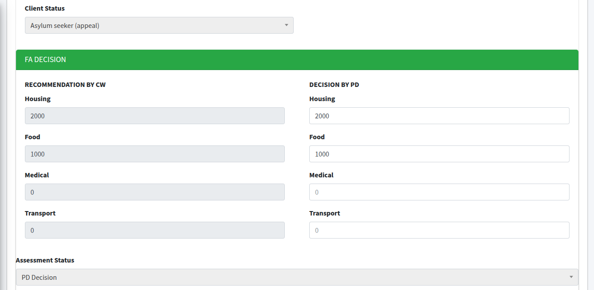

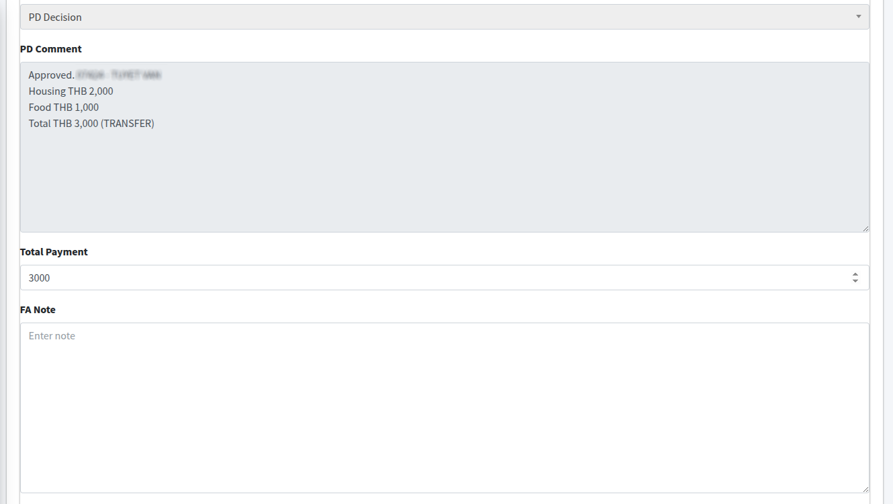

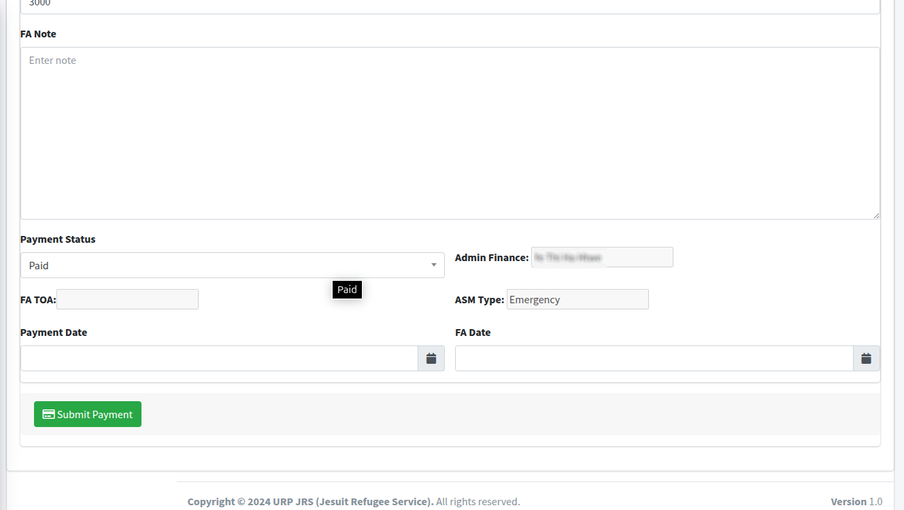

As a Finance user, you can **edit** the following fields:

1. **FA Notes** - Add any financial approval notes if needed
2. **Payment Status** - Select "Paid" (this option is selected by default)
3. **Payment Date** - Set the actual payment date
4. **FA Date** - Set the financial approval date
5. **Submit Payment** - Click the submit button to complete the process

#### Invoice Generation

The Invoice feature allows Finance users to generate official PDF invoices for paid financial assistance cases.

**How to Generate an Invoice -**

1. **Locate the Client** - Find the paid case in the Financial Approval table by entering URPID in the search box
2. **Click Invoice Button** - Click the "Invoice" button in the Action column for the specific client
3. **PDF Download** - The system automatically generates and downloads a PDF invoice

**Invoice Content -**
The generated PDF invoice contains:
- Client information and case details
- Approved assistance amounts by category (Housing, Food, Medical, Transport)
- Authorization details and approval dates
- Official JRS branding and formatting
- Reference numbers for tracking and record-keeping

#### Update Pictures Clients

The "Update Pictures Clients" feature allows Finance users to update client ID card images in the system.

**Accessing Update Pictures -**

1. **Locate the Client** - Find the client case in the Financial Approval table
2. **Click Update Picture Button** - Click the "Update Picture Clients" button in the Action column
3. **Upload Interface** - The system opens a dedicated page for image updates

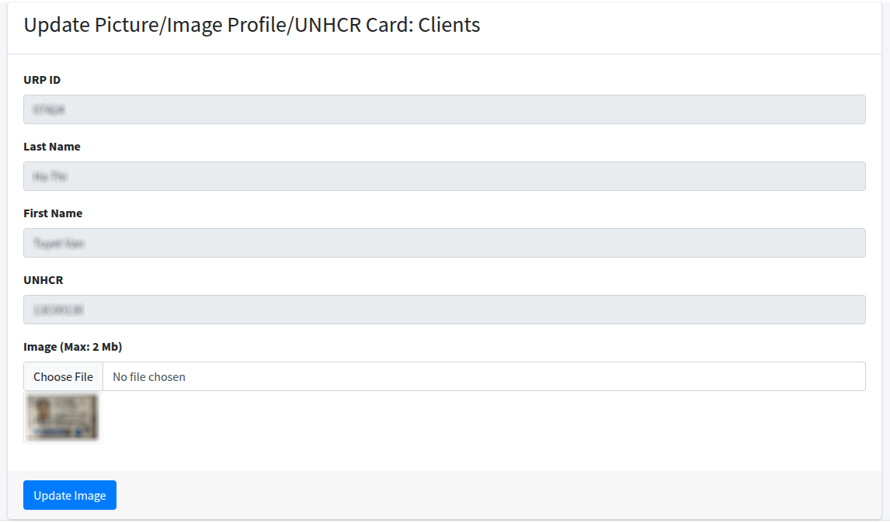

### Financial Approval History

Access historical financial approval data through the Financial Approval History feature.

#### Accessing Financial History

1. From the sidebar, click on "Financial Approval History" (located under the Admin & Finance Menu)

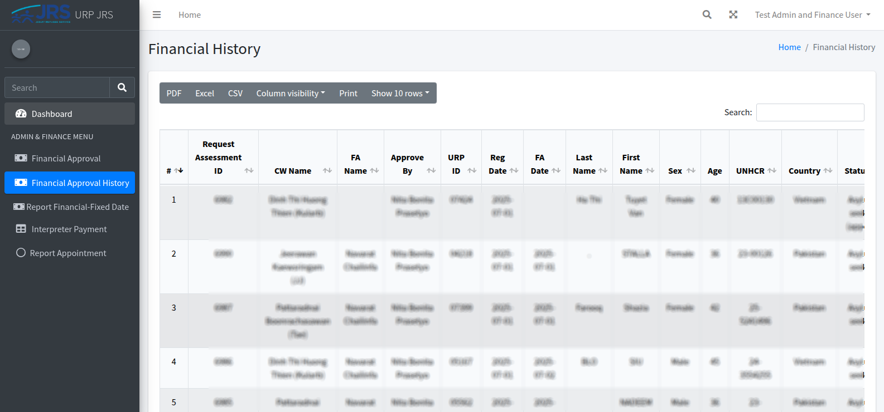

**Features -**
- **Search and Filter** - Locate specific historical records using the search functionality
- **Export Options** - Download historical data in PDF, Excel, or CSV formats for reporting

### Report Financial-Fixed Date

The "Report Financial-Fixed Date" feature provides targeted financial reporting with date range selection capabilities.

#### Accessing Fixed Date Reports

1. From the sidebar, click on "Report Financial-Fixed Date" (located under the Admin & Finance Menu)

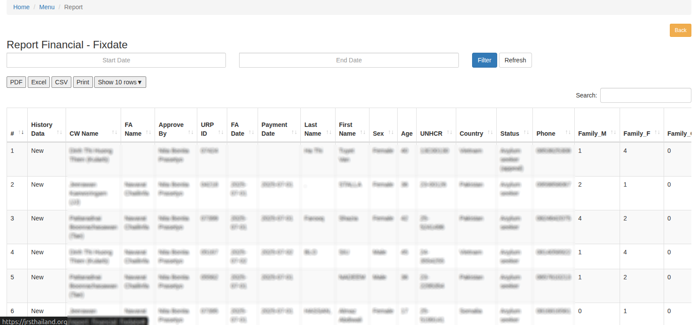

**Features -**
- **Date Range Selection** - Choose specific start and end dates for targeted reporting
- **Filtered Export** - Export only the financial approvals within the selected date range
- **Same Export Options** - PDF, Excel, CSV formats available for download

### Interpreter Payment

- From the sidebar, click on "Interpreter Payment" (located under the Admin & Finance Menu)

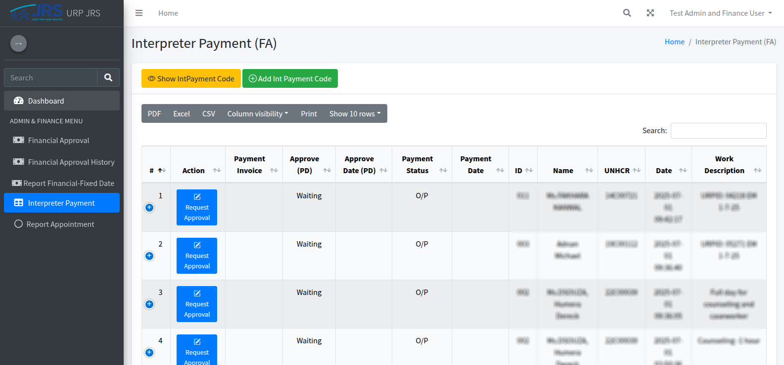

**Step 1 - Request Payment Approval -** _(can also be done by Reception)_
1. **Access Interpreter Records** - Navigate to interpreter payment list by clicking Interpreter Payment menu
2. **Click Request Approval** - Click "Request Approval" button in Action column (only visible for pending records)
3. **Update Payment Details** - Modify payment information and add notes
4. **Submit for Approval** - Send request to Project Director for approval

**Step 2 - Process Payment Settlement -** _(can be done by Admin & Finance only)_
1. **Access Approved Records** - View Project Director approved interpreter payments
2. **Click Process Payment** - Click "Process Payment" button in Payment Status column (only visible for approved records)
3. **Auto-Generated Fields** - System creates payment code and sets payment date
4. **Complete Payment** - Submit to mark payment as "Paid" status

- **Request Approval** - Only visible when payment approval not yet requested
- **Process Payment** - Only visible when Project Director approved but payment status is "Outstanding Payment"
- **Invoice** - Only visible when payment is both approved and marked as "Paid"

### Report Appointment
The "Report Appointment" menu generates a report for all client appointments and assessment-related communications in the JRS URP system.

From the sidebar, click on "Report Appointment" (located under the Admin & Finance Menu)

#### Report Features
- Date Range Filtering - Select specific start and end dates to filter appointment records
- Export Options - Download reports in PDF, Excel, CSV formats for external analysis
- Search - Search across all data fields to locate specific appointments or clients

## Navigation Tips

- Use the sidebar navigation to move between different sections
- The "Back" button (yellow button) can be used to return to the previous page
- All reports include export functionality for data analysis
- Use date filters to narrow down results to specific time periods
