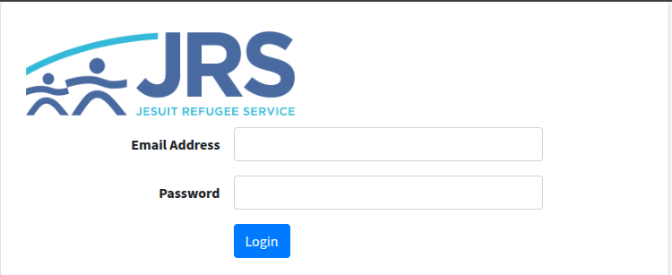
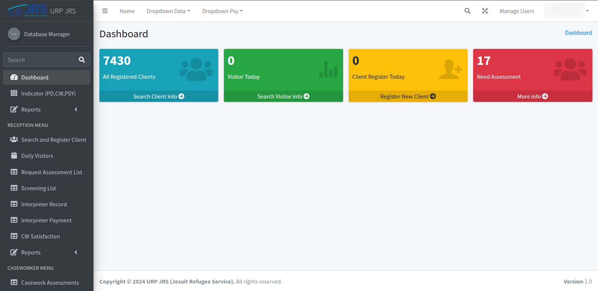
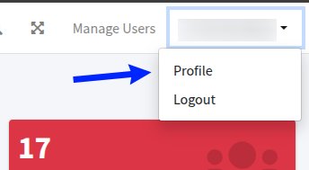
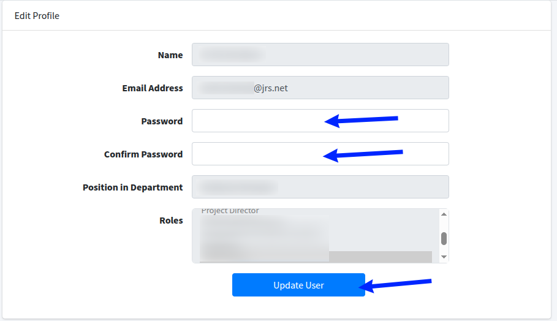

This guide will help you get started with the JRS URP application by walking you through the login process and introducing you to the main dashboard.

## 1. Login to the System

Navigate to [jrsthailand.org](https://jrsthailand.org) and login with your credentials.

- Enter your email address in the "Email Address" field
- Enter your password in the "Password" field  
- Click the "Login" button to access the dashboard

## 2. Dashboard Overview

After logging in, you'll see the main dashboard with stats overview.

The dashboard displays -
- All Registered Clients
- Visitor Today
- Client Register Today
- Need Assessment

You can access various features through the sidebar navigation on the left.

## Resetting Password

To reset your password while logged in:

### Step 1: Access Profile Menu

1. Click on your username in the top right corner of the page

2. Select **Profile** from the dropdown menu

### Step 2: Update Password

3. In the Edit Profile page, locate the password fields

4. Enter your new password in the **Password** field
5. Confirm your new password in the **Confirm Password** field
6. Click the **Update User** button to save your changes

**Important Notes -**
- Make sure both password fields match exactly
- Choose a strong password for security
- Your password will be updated immediately after clicking "Update User"

:::caution
If you're locked out and can't log in, contact your system administrator for password reset assistance.
:::

## Next Steps

Now that you're familiar with logging in and the dashboard layout, you can explore the specific menu features -

- **[Admin & Finance Menu Guide](/urp/finance-menu/)** - Learn about financial approval processes and reporting
- **[Reception Menu Guide](/urp/reception-menu/)** - Explore client intake and management features

The sidebar navigation provides access to different modules based on your role and permissions within the JRS URP system.